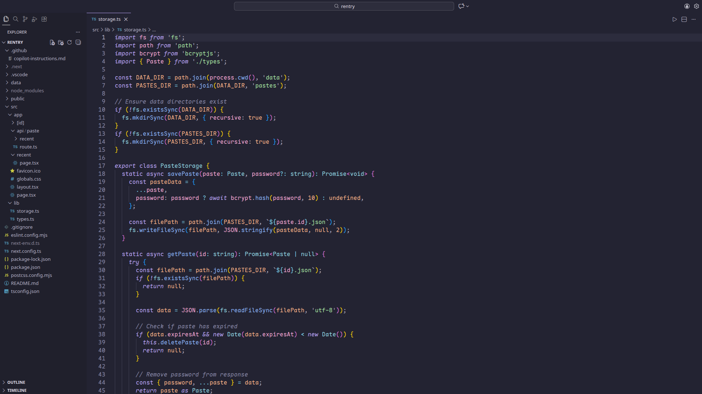
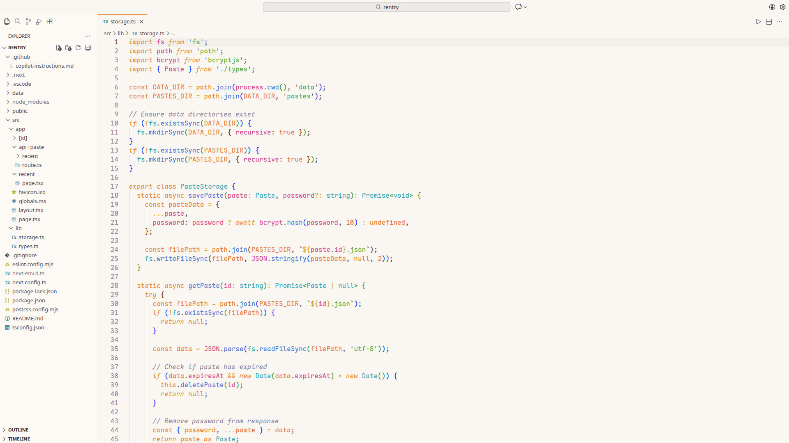
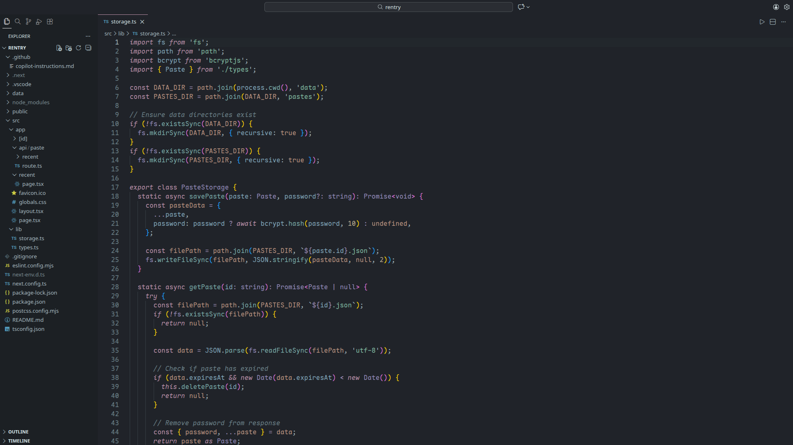
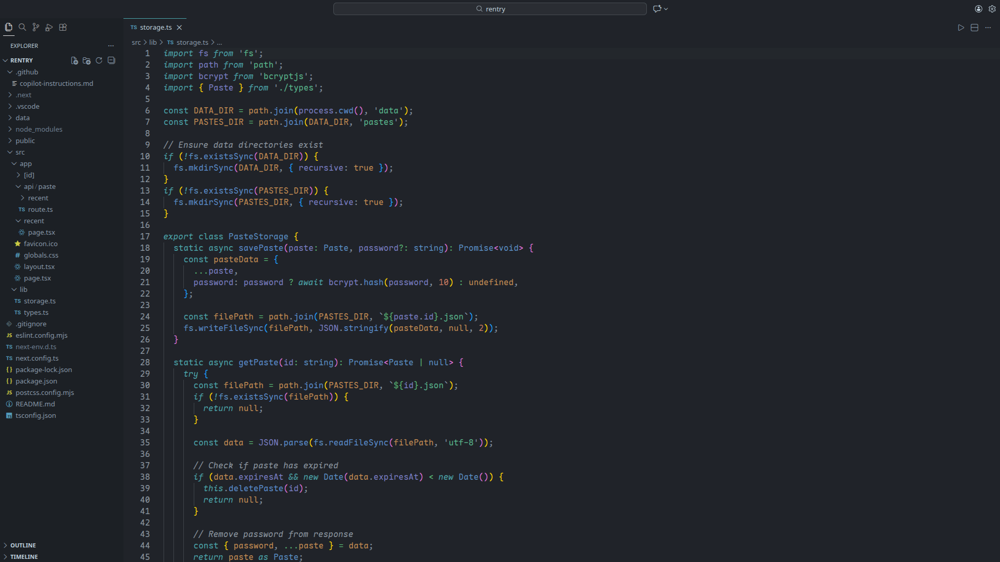
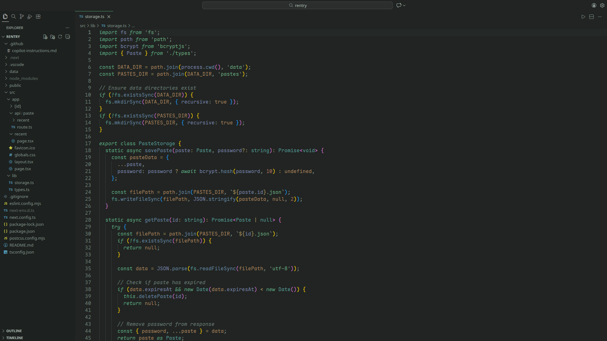
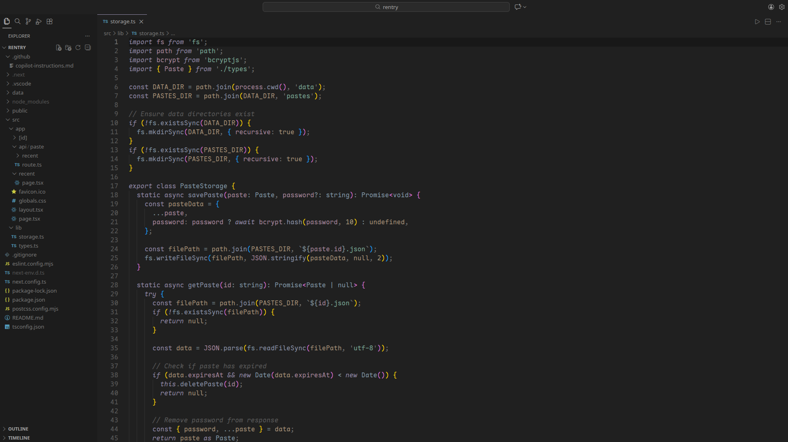

<div align="center">

# ✨ Zenith

**Premium colorscheme collection for VS Code • Base46 Architecture**

[](https://github.com/samonide/zenith-vsc)
[](LICENSE)

[Website](https://samonide.github.io/zenith/) • [GitHub](https://github.com/samonide/zenith) • [Issues](https://github.com/samonide/zenith-vsc/issues)

*Soft pastels designed for comfortable long coding sessions*

</div>

---

## 🎨 Variants

Eight professionally crafted themes, each with its own character:

<div align="center">

### 🌙 Zenith Dusk


*Flagship theme with perfectly balanced soft pastels*

---

### ☀️ Zenith Dawn


*Elegant light theme with vibrant blues and gentle contrast*

---

### ✨ Zenith Aurora


*Ethereal teals, pinks, and dreamy lavenders*

---

### 🌸 Zenith Rosé


*Warm rose-tinted with cozy dark grey backgrounds*

---

### 🌊 Zenith Ocean


*Deep serene blues and aqua tones for tranquil focus*

---

### 🌲 Zenith Forest


*Natural vibrant greens for grounded productivity*

---

### 🌑 Zenith Midnight


*Pure deep darkness with high contrast pastels*

---

### 🧘 Zenith Zen


*Ultra-minimal monochrome for deep concentration*

---

</div>

## 🏗️ Architecture

Zenith uses the **[base46](https://github.com/NvChad/base46)** architecture — an industry-standard theming system designed for universal compatibility and portability across editors, terminals, and tools.

### What's New in v6.0.0

- ✨ **Complete redesign** based on base46 color architecture
- 🎨 **Eight unique variants** matching the main Zenith repo
- 🌸 **Zenith Rosé** - warm rose tones for cozy coding
- 🧘 **Zenith Zen** - ultra-minimal monochrome focus
- 🎯 **Improved color consistency** across all themes
- 💎 **Enhanced syntax highlighting** with better token differentiation
- 🖼️ **Panel transparency** with borders only on terminal (like standard themes)
- 🔄 **Synchronized with main Zenith repo** for cross-platform consistency

</div>

## 📦 Installation

**Marketplace**: Search `Zenith Theme` in VS Code extensions

**Manual**: Press `Ctrl+Shift+P` → `Install from VSIX` → Select `.vsix` file

**Activate**: Press `Ctrl+K Ctrl+T` → Choose your variant

## ⚙️ Recommended Settings

```json
{
  "editor.fontFamily": "'JetBrains Mono', 'Fira Code', 'Cascadia Code'",
  "editor.fontLigatures": true,
  "editor.semanticHighlighting.enabled": true
}
```

---

<div align="center">

Made with 💜 by [samonide](https://github.com/samonide)

</div>